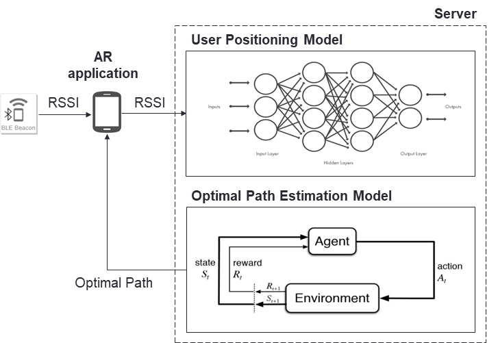
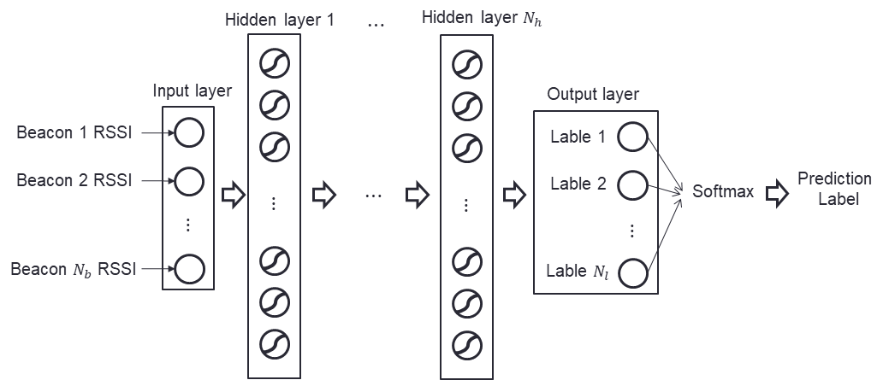
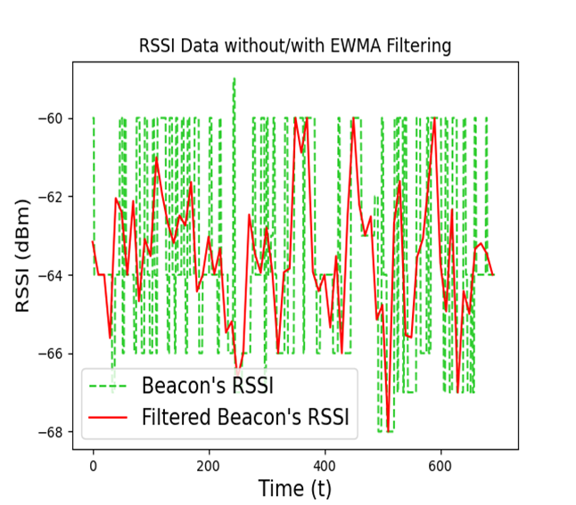
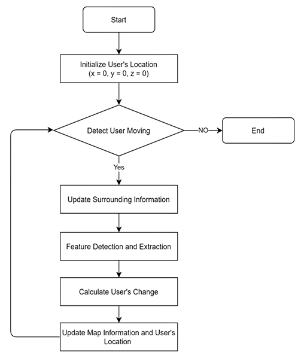
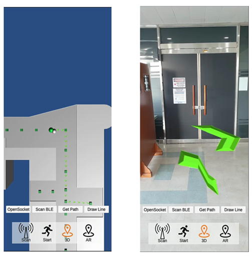
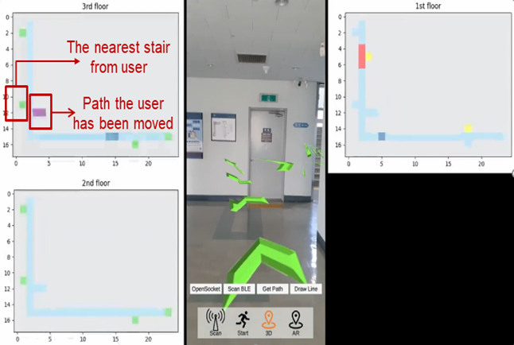
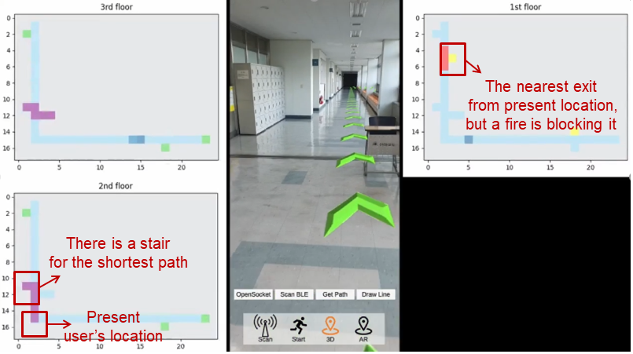
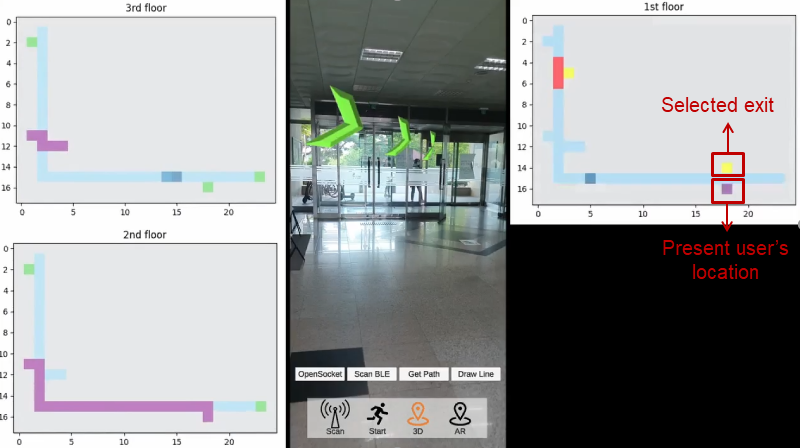

### 실내 화재 상황에서 머신러닝 기반의 최적 대피 경로 안내 AR 내비게이션 시스템 연구

### :heavy_check_mark:핵심

[2022.01 한국통신학회 논문지(KCI) 게재](https://www.dbpia.co.kr/journal/articleDetail?nodeId=NODE11024371)  

**기간** : 2020/12 ~ 2022/01  

 

**프로젝트 요약** : 본 논문에서는 머신러닝과 AR을 이용하여 실내 화재 상황에서의 최적 대피 경로 안내 시스템을 제안한다. 사용자 위치 추정을 위해 실제 시스템을 적용할 장소에 BLE 비콘 환경을 조성한 후, 위치에 따른 비콘 신호의 RSSI 데이터를 수집한다. 수집한 데이터를 바탕으로 심층신경망 모델을 학습하여 사용자 위치를 결정한다. 최적 대피 경로 도출에는 Q-learning을 활용하며, 사용자 위치와 화재 위치, 대피 경로의 혼잡 상황 등의 정보를 종합적으로 반영한다. 도출된 대피 경로는 안드로이드 AR 애플리케이션을 통해 직관적으로 제공한다. 실제 수집한 RSSI 데이터를 기반으로 한 성능평가에서 사용자 위치 추정은 높은 정확도를 보였다. 또한, Q-Learning을 통해 위험한 지역을 피하고 최단 시간이 소요되는 경로를 도출하였다. 본 논문에서 제안하는 시스템을 통해 개개인의 신속한 대피를 도와 인명피해를 줄일 수 있을 것으로 보인다.  

**역할** : 멘토  

* [학부 시절 했던 연구](https://github.com/seunghee73/RL-optimal-path-project)를 석사 과정에 학부 연구생들과 발전시켰다.  
  * GPS로는 실내에 있는 사용자의 정확한 위치를 추적할 수 없다. 따라서 연구는 실내에서 사용자가 어디에 있는지를 예측하는 것부터 시작한다.  
  * 학부 시절 연구에는 심층신경망 모델이 사용자의 위치를 x, y, z 값으로 예측하도록 학습시켰고 이를 다시 강화학습에 적용하기 위해  셀로 변환하였다. 거리 오차가 1.5m에 불과했지만 이를 셀로 변환시키는 과정에서 하나의 셀이 차이나게 되는 문제가 존재했다.  
  * 본 연구는 실제 공간을 셀로 구분하고 각 셀에서 데이터를 수집하였다. 그리고 이를 이용하여 비콘으로부터 수신되는 RSSI(Received Signal Strength Indicator) 신호가 입력으로 들어왔을 때 어느 셀에 위치하는지 예측하도록 심층신경망 모델을 학습하여 문제를 해소하였다.  
  * 단순히 파이썬 시뮬레이션 환경상에서 확인이 가능했던 최적 경로를 AR(Augmented Reality) 기술을 이용하여 실제 사용자에게 전달할 수 있도록 연구를 발전시켰다.  
* 비콘으로부터 수신되는 RSSI 신호의 잡음을 제거하는 과정에서 데이터 전처리 중요성에 대해서 배웠다.  

 

### :heavy_check_mark:프로젝트 정리

### 서론

* 일반적으로 위치 결정에는 GPS(Global Positioning System)기술이 많이 활용되나, 실내 및 지하에서 사용하게 되면 신뢰성이 떨어지기 때문에 본 알고리즘으로 이용하기에 부적합하다. 따라서 비콘으로부터 얻은 RSSI를 학습된 심층 신경망 모델에 이용해 사용자가 위치한 셀을 출력하는 방식을 사용한다.  
* 얻은 사용자의 위치 정보와 주어진 실내 환경의 출구에 대한 정보를 이용하여 사용자의 위치에서 탈출구로 가는 최적 경로를 찾는다. 단순히 최단 경로가 아니라 재난 상황을 피한 최적 경로를 산출하기 위해 Q-Learning을 이용한다.   
* 사용자의 위치와 최적 경로를 AR 애플리케이션을 통해 사용자에게 제공하여 사용자가 최적의 대피 경로를 직관적으로 확인할 수 있도록 한다.   

 

### 머신러닝 기반의 최적 대피 경로 안내 AR 내비게이션 시스템

 

* 최적 대피 경로 안내 AR 내비게이션을 위한 시스템은 크게 사용자 위치 결정 모델, 최적 대피 경로 추정 모델, AR 대피 경로 안내로 구분된다.  
* 사용자 위치 결정 모델은 구역별로 수집한 비콘의 RSSI을 이용하여 심층 신경망을 학습시키고 이를 이용하여 사용자의 위치를 예측한다.  
* 최적 대피 경로 추정 모델은 Q-Learning을 이용하여 화재의 위치, 대피 경로의 혼잡 상황 등을 종합적으로 고려하여 최단 시간 대피 경로를 도출한다.   
* 서버에서는 도출한 최적 대피 경로를 다시 AR 애플리케이션을 통해 사용자에게 제공한다.   

 

#### 사용자 위치 결정을 위한 심층 신경망 모델  

 

* 공간을 셀로 구분하고 비콘을 배치한 실내를 가정한다.   

* 심층 신경망 모델의 입력 값으로는 사용자의 위치에서 비콘으로부터 수신되는 RSSI 값을 이용하며 사용자의 위치가 속한 셀을 출력 값으로 사용한다.  

  * 사용자의 위치에서 수신한 RSSI 값을 그대로 사용하는 경우 잡음에 의해 사용자의 위치 정확도가 감소할 수 있다.   
  * 서버에서는 학습의 정확도를 높이기 위하여 건물 내부의 다양한 요소로 발생한 신호의 잡음을 제거하는 필터링을 수행한다.  
  * 본 연구에서는 EWMA(Exponentially Weighted Moving Average) 필터를 사용하였다.  
    * 최근 정보들에 지수적으로 큰 가중치를 부여하여 시스템의 변동에 민감하게 반응  
    
    

     
    

  
  * 시간에 따른 EWMA 필터를 수행하지 않은 RSSI 값과 EWMA 필터를 수행한 RSSI 값을 비교한 것이다. EWMA 필터 수행한 RSSI의 값이 필터를 수행하지 않은 RSSI값에 비해 변동이 더 적은 것을 알 수 있다.  

#### 최적의 대피로 추정을 위한 Q-러닝 모델  

* 사용자 위치 추정 결과를 기반으로 최적의 대피 경로를 추정하기 위해 강화학습 방법 중 하나인 Q-Learning을 이용한다.  
* 제안하는 최적의 대피 경로 도출 시스템은 건물 내부구조와 실내 화재 위치, 구역별 인구수를 기반으로 Q-Learning을 진행한다.   
* 강화학습의 **환경(Environment)** 인 건물 내부 구조는 복도를 셀로 구분하고 각각의 셀을 **상태(state)** 로 지정한다.  
* 건물 내에 사용자의 현재 상태에서 선택 가능한 **행동(action)** 은 앞, 뒤, 왼쪽, 오른쪽, 아래로 5가지 행동을 선택할 수 있다.   
* 사용자의 최적 탈출 경로 도출은 서버에서 가상 시뮬레이션을 통해 이루어지며, 매 위치가 변화할 때마다 설계된 **보상 함수(reward)** 에 따라 해당 상태에서 선택한 행동에 대한 보상이 주어진다.  

 

#### AR 내비게이션을 위한 시스템 설계 및 구현  

* 사용자에게 경로 안내 시스템을 직관적으로 제공하기 위해 증강현실(AR, Augmented Reality)을 이용한다.  
* 증강현실이란 현실에 기반하여 정보를 추가 제공하는 기술로 현실 세계의 이미지나 배경에 가상의 이미지를 추가하기 위해 사용되는 기술이다.  

  

* 사용자와 3D 객체의 상대적 위치 측정을 위해 Visual SLAM(Simultaneous Localization and Mapping)을 사용하였다.  
* Visual SLAM은 카메라 영상에서 특징점이라는 시각적으로 구별되는 특징을 감지한다. 그리고 이 점을 사용하여 위치 변화를 계산하며, 시각적 정보는 IMU(Inertial Measurement Unit) 센서의 관성 측정과 결합하여 실제 환경에서의 카메라의 위치 및 방향을 추정한다.  
* 카메라의 시점이 이동되어도 Visual SLAM을 통해 증강현실 객체들의 위치 또한 상대적으로 변하여 실제로 사물이 특정 위치에 고정되어있는 것처럼 동작한다.  
* 대피 경로를 스마트폰 애플리케이션에 증강현실을 이용하여 표시하기 위해 소켓 프로그래밍을 이용하여 서버와 사용자를 연결한다.  
* 유니티(Unity)에 내장된 기술인 Line Rendering에 이용하여 애플리케이션 상에 표현될 수 있도록 한다.  

  

* 제공되는 UI는 사용자의 시점으로 두 가지 방식을 사용할 수 있도록 구현한다.  
  * 첫 번째는 사용자의 위치를 3인칭 관점으로 바라본 방식이다. 현재 위치에서부터 탈출구까지 전체 경로를 볼 수 있다.   
  * 두 번째는 실제에 AR을 적용한 방식으로 사용자의 위치를 1인칭 관점으로 바라본 방식이다. 현재 위치에서 어떠한 방향으로 이동을 해야 하는지에 대한 경로를 볼 수 있다.  
  * ‘OpenSocket’ 버튼 : 소켓 프로그래밍을 진행하여 서버와 연결  
  * ‘ScanBLE’ 버튼 : 비콘의 RSSI 신호를 수신, 서버에서는 비콘의 MAC 주소와 RSSI 수신 및 사용자의 위치를 추정  
  * 'GetPath' 버튼 : 사용자의 스마트폰으로 현재 위치부터 탈출구까지 수열 형태로 된 최적 경로가 전송  
  * 'DrawLine' 버튼 : 최종적으로 AR 경로를 표시  

 

### 시뮬레이션  

* 사용자의 위치 추정을 위한 심층신경망 모델과 최적 대피 경로 산출을 위한 Q-Learning 모델을 연결하고 AR 내비게이션 시스템을 통해 사용자에게 최적 대피 경로를 제공하는 것을 확인하였다. 
* 실제 상황에서 실내에 있는 사용자의 현재 위치를 파악하고 AR 내비게이션을 이용하여 탈출구까지 최적의 경로를 안내하는 과정을 보여준다.
* 실제로 화재를 발생시킬 수는 없었기 때문에 임의의 지점에서 화재가 발생하였다고 가정하고 시뮬레이션을 진행하였다.

  

* 3층에서 사용자가 AR 내비게이션 애플리케이션을 사용했을 때, 사용자의 정확한 위치를 확인하고 AR을 통해 사용자에게 최적의 대피 경로를 안내하는 것을 보여준다.   
* 애플리케이션이 사용자의 현재 위치에서 가장 가까운 계단으로 경로를 안내하는 것을 확인할 수 있다.  

  

* 3층에서 애플리케이션이 안내한 경로를 통해 2층으로 내려왔을 때의 상황을 보여준다.   
* 사용자에게 가장 가까운 출구는 1층의 위쪽에 있는 출구이고 이를 이용하기 위해서는 가장 가까운 계단을 이용하여 그대로 내려가면 된다.   
* 하지만 그 위치의 출구는 화재로 인해 막힌 상황이기 때문에 이를 피하기 위해 사용자는 1층 아래쪽에 있는 출구를 이용해야한다.   
* 따라서 1층으로 내려가기 위한 경로 역시 현재 위치에서 가장 가까운 계단이 아니라 이용 가능한 출구에 가까운 계단으로 안내하는 것을 확인할 수 있다.  

  

* 최종적으로 애플리케이션이 사용자에게 출구를 성공적으로 안내한 모습을 확인할 수 있다. 

 
